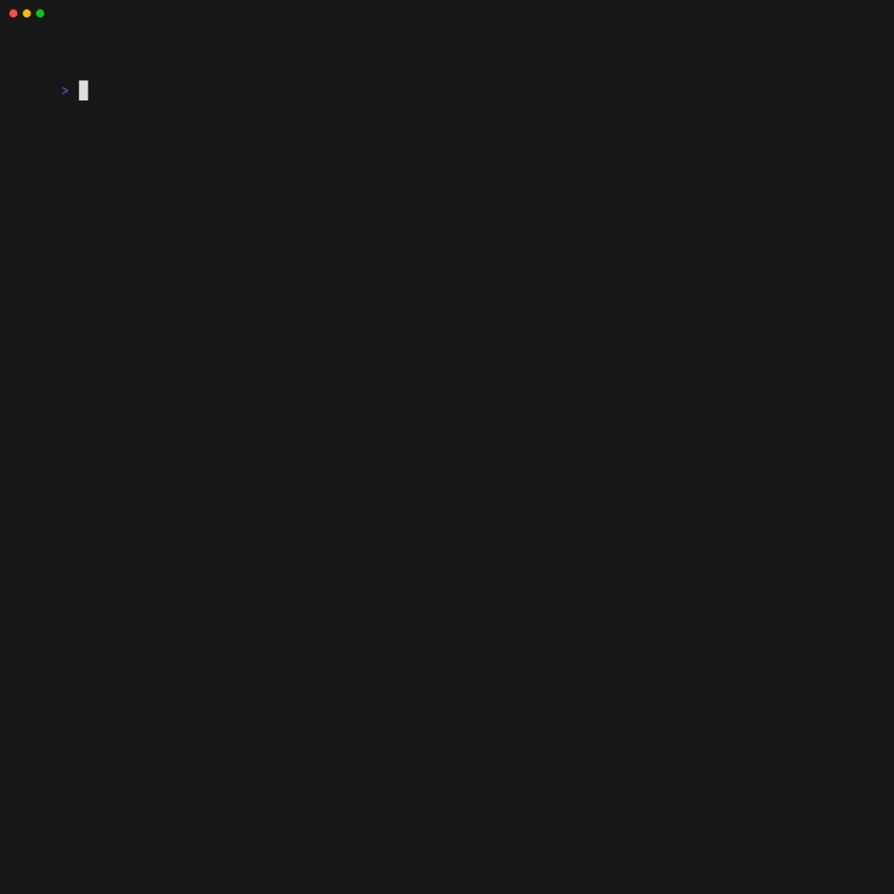

# Mercedes-Benz Go

[](https://pkg.go.dev/github.com/way-platform/mbz-go)
[](https://goreportcard.com/report/github.com/way-platform/mbz-go)
[](https://github.com/way-platform/mbz-go/actions/workflows/release.yaml)

A Go SDK and CLI tool for the Mercedes-Benz [Connect Your Fleet APIs](https://developer.mercedes-benz.com/products/connect_your_fleet), and [Vehicle Specification APIs](https://developer.mercedes-benz.com/products/vehicle_specification_fleet/).

## SDK

### Features

- Support for the [Vehicle Management API](https://developer.mercedes-benz.com/products/connect_your_fleet/specifications/vehicle_management_api)
- Support for the [Services Catalog API](https://developer.mercedes-benz.com/products/connect_your_fleet/specifications/services_catalog_api)
- Support for the [Push API](https://developer.mercedes-benz.com/products/connect_your_fleet/specifications/push_api)
- Support for the [Vehicle Specification API](https://developer.mercedes-benz.com/products/vehicle_specification/specifications/vehicle_specification)

### Installing

```bash
$ go get github.com/way-platform/mbz-go
```

### Using

```go
ctx := context.Background()
// Create a Mercedes-Benz API client.
client, err := mbz.NewClient(
    ctx,
    mbz.WithRegion(mbz.RegionECE),
    mbz.WithClientID(os.Getenv("MBZ_CLIENT_ID")),
    mbz.WithClientSecret(os.Getenv("MBZ_CLIENT_SECRET")),
)
if err != nil {
    panic(err)
}
// List vehicles in the account.
response, err := client.ListVehicles(ctx, &mbz.ListVehiclesRequest{})
if err != nil {
    panic(err)
}
for _, vehicle := range response.Vehicles {
    fmt.Println(vehicle.VIN)
}
// For all available methods, see the API documentation.
```

### Developing

#### Building

The project is built using [Mage](https://magefile.org), see
[tools/magefile.go](./tools/magefile.go) and the [tools/mage](./tools/mage)
helper script.

```bash
$ ./tools/mage build
```

For all available build tasks, see:

```bash
$ ./tools/mage -l
```

## CLI tool

The `mbz` CLI tool enables interaction with the APIs from the command line.



### Installing

```bash
go install github.com/way-platform/mbz-go/cmd/mbz@latest
```

Prebuilt binaries for Linux, Windows, and Mac are available from the [Releases](https://github.com/way-platform/mbz-go/releases).

### Kafka Consumer

The CLI tool has a simple Kafka consumer that can read from a [Push
API](https://developer.mercedes-benz.com/products/connect_your_fleet/specifications/push_api)
Kafka topic.

```bash
$ mbz consume-vehicle-signals --consumer-group $MBZ_CONSUMER_GROUP --topic $MBZ_TOPIC
{
  "messageId": "54979700-c5c3-44ff-9ffa-5e961d7da84b",
  "vin": "S0FTCARMB00000001",
  "timestamp": 1753362541271,
  "messageType": "vehiclesignal",
  "version": "1.0",
  "serviceId": "1003",
  "sendingBehaviour": "ON_CHANGE",
  "data": {
    "signals": [
      {
        "name": "Driving.Range.Fuel.Warning",
        "timestamp": 1753362541025,
        "value": "false",
        "type": "boolean"
      },
      {
        "name": "Tank.Fuel.Level.Absolute",
        "timestamp": 1753362541025,
        "value": "36",
        "type": "integer"
      },
      {
        "name": "Tank.Fuel.Level.Warning",
        "timestamp": 1753362541025,
        "value": "false",
        "type": "boolean"
      }
    ]
  }
}
```

## License

This SDK is published under the [MIT License](./LICENSE).

## Security

Security researchers, see the [Security Policy](https://github.com/way-platform/mbz-go?tab=security-ov-file#readme).

## Code of Conduct

Be nice. For more info, see the [Code of Conduct](https://github.com/way-platform/mbz-go?tab=coc-ov-file#readme).
